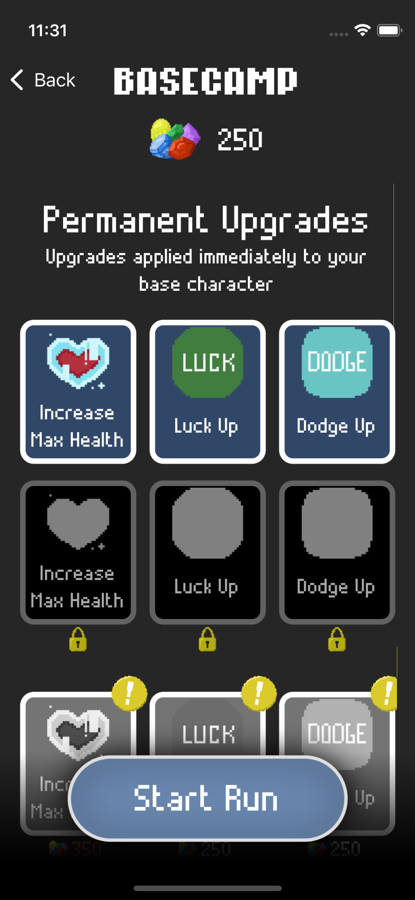

## Shift Shaft is out now on the iOS Store
[Available here.](https://apps.apple.com/us/app/shift-shaft/id1387207777)

Shift Shaft is strategic match-3 puzzle game that adds a interesting spin on a classic genre.  In Shift Shaft, players can rotate the board; this simple mechanic creates endless complexity and makes Shift Shaft enjoyable for newcomers and veterans alike.  

Players take control of a miner who must navigate through mineshaft to fight monsters, collect gems, and try to escape.  Most attempts end in failure, but that's okay, everytime the player dies the Mineral Spirits which them back to Basecamp where they can upgrade their character and try again.  Players unlock better and better upgrades over time that bolster their stats like health, dodge, and luck and increase the power of the items they can find in the mines.

    

A giant gem-eater spider awaits players on the 10th level.  Why does this spider hate you? That is a mystery, but there is only one way out of the mines at it is through the boss.  The boss is larger-than-life and puts an exclamation point on the game's finale

    

## Shift Shaft is out now on the iOS Store
[Available here.](https://apps.apple.com/us/app/shift-shaft/id1387207777)
